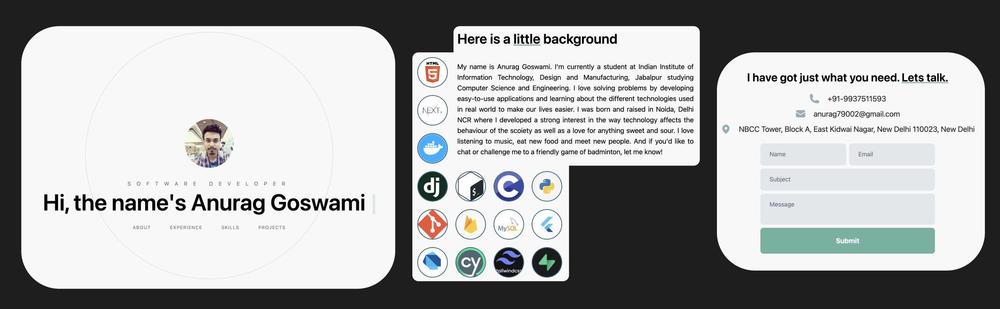
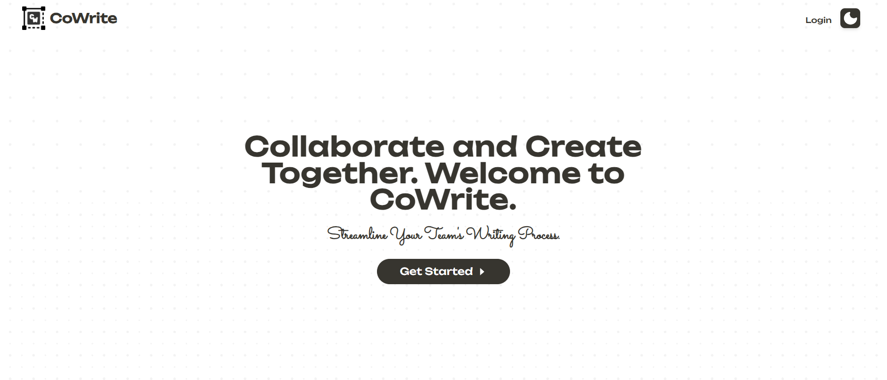
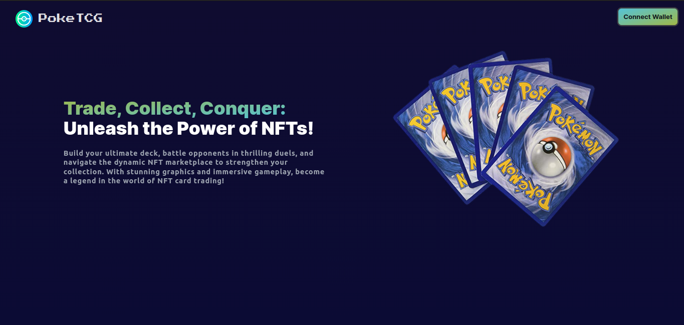
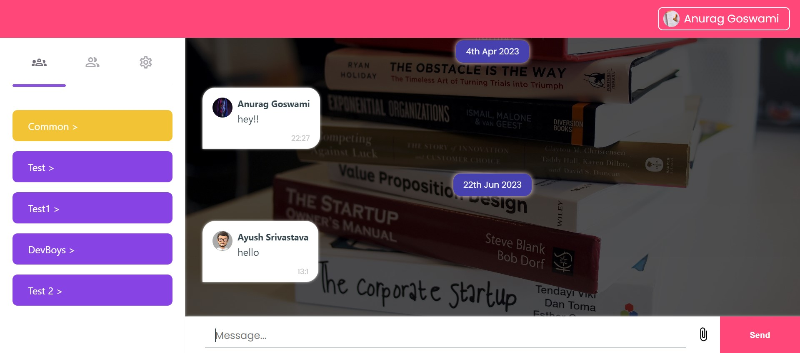
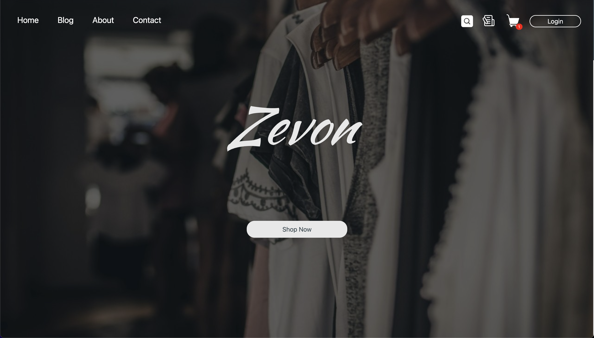
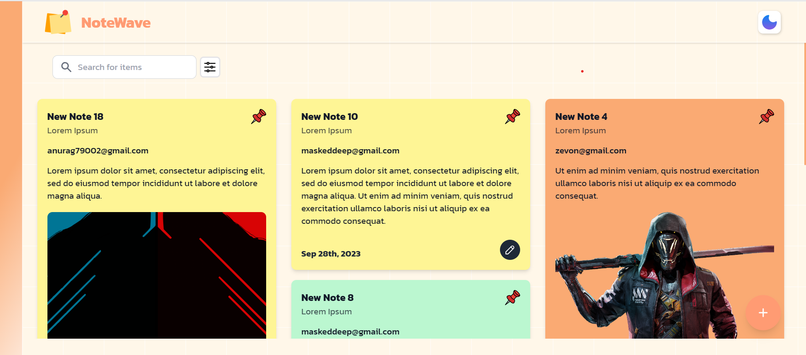
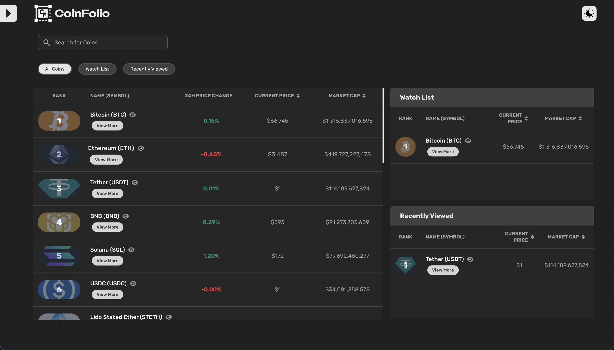

# Anurag's Portfolio

- **LinkedIn**: [LinkedIn Profile](https://www.linkedin.com/in/anurag7902/)
- **GitHub**: [GitHub Profile](https://github.com/Anurag607)
- **Resume/CV**: [Resume/CV](https://drive.google.com/file/d/1DDTaYwZHuW7lIR7x32XjO6EPp09gjgql/view?usp=sharing)

🚀 Aspiring Tech Innovator and Full-Stack Developer 🌟

👋 Hello there! I'm Anurag Goswami, and I'm on a relentless pursuit of excellence in the world of technology. With a diverse skill set spanning multiple programming languages, frameworks, and tools, I'm on a mission to drive innovation and create impactful solutions.

💻 I'm a versatile developer with expertise in:

- Python, C, C++, Java, C#, JavaScript, TypeScript, Bash, SQL
- HTML/CSS, Dart, ReactJS, NextJS, React-Native, Flutter
- NodeJS, ExpressJS, Flask, Django, Socket.io
- TailwindCSS, SCSS, Material-UI (MUI)
- Databases: Firebase, Supabase, SQLite, PostgreSQL, MySQL, Redis, MongoDB
- Containerisation: Docker
- Version Control: Git and GitHub
- Design Tools: Postman, Figma, Adobe Photoshop

🔨 My passion lies in crafting elegant code and developing robust applications. I thrive in collaborative environments, and my experiences have honed my ability to work efficiently in agile teams, delivering value through software that empowers businesses and delights users.

🛠️ Here are a few of my projects that showcase my skills and dedication:

1. **[CoWrite](https://co-write-rosy.vercel.app)**: A comprehensive text editor integrating real-time collaboration and cloud storage. Check the code on [GitHub](https://github.com/anurag607/CoWrite).
2. **[PokeTCG](https://poketcg.vercel.app/)**: An NFT trading card game built on the Polygon blockchain. View the code on [GitHub](https://github.com/anurag607/PokeTCG).
3. **[xLine](https://xline.vercel.app/)**: A real-time chat app with rich features and a responsive UI. See the code on [GitHub](https://github.com/anurag607/xLine).
4. **[Zevon](https://zevon.vercel.app/)**: A user-friendly retail platform with secure payments and dashboards for buyers and sellers. View the code on [GitHub](https://github.com/anurag607/Zevon).
5. **[NoteWave](https://notewave.vercel.app)**: A community note-keeping app with a sleek UI and dark mode. Check the code on [GitHub](https://github.com/anurag607/NoteWave).
6. **[CoinFolio](https://coinfolio-tan.vercel.app/)**: A crypto tracker with watchlist and drag-and-drop features. View the code on [GitHub](https://github.com/anurag607/CoinFolio).
   

🔗 Connect with me on [LinkedIn](https://www.linkedin.com/in/anurag7902/) or explore my projects on [GitHub](https://github.com/Anurag607). You can also find my comprehensive portfolio at [Anurag607](https://anurag607.github.io/Anurag607/).

Let's embark on a journey of innovation and make an impact together. I'm excited to connect and collaborate with fellow tech enthusiasts, entrepreneurs, and visionaries!
